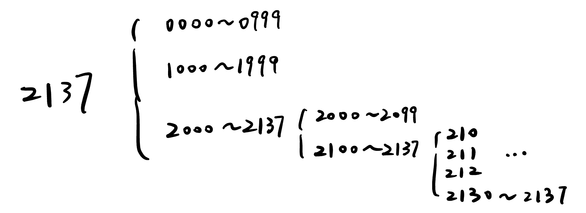
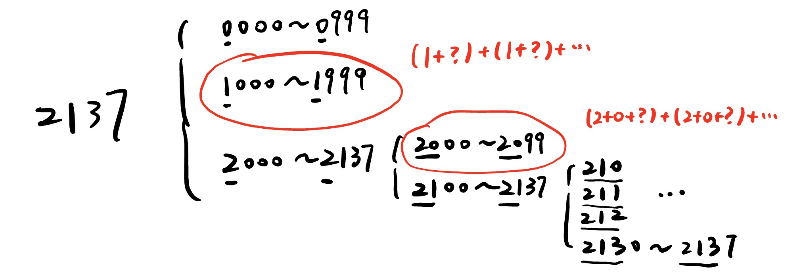

# 数位 DP

数位 DP 是一种用于解决**与数字的每一位相关**的计数或判定问题的动态规划技巧。它常用于在给定区间（如 $[L, R]$）内，统计满足某些“数字结构”性质的整数个数。

### 例: [烦人的数学作业 - 洛谷](https://www.luogu.com.cn/problem/P4999)

题目要求从 L 到 R 的所有数字的 数字和 的总和。

运用前缀和的思想，将 $L\to R$ 转化为 $(1\to R) - (1 \to L)$，将原问题拆分为 $1\to R, 1 \to L$ 两个独立的问题。

我们来看 1~2137 这个例子。



首先我们对它进行了拆分，这个过程其实就是从高位向低位进行了递归：

将每一位分为两种情况：

1. 当前位小于数字原位置（后续的数位可以忽略上限）
2. 当前位等于数字原位置（后续的数位必须考虑上限）

我们根据上面这个图的思路写一个暴力：

```cpp
LL dfs(int dep, int sum, bool lim)
{
    if (!dep)
        return sum;
    LL res = 0, up = (lim ? a[dep] : 9);
    for (int i = 0; i <= up; i++)
    {
        res += dfs(dep - 1, sum + i, lim && (i == up));
    }
    return res;
}
LL Calc(int k)
{
    int len = 0;
    while (k)
    {
        a[++len] = k % 10;
        k /= 10;
    }
    return dfs(len, 0, 1) % mod;
}
```

其中，dep 表示当前枚举的位数（最高位是 len，最低为是 1）；

sum 表示前面枚举过位置的数字和；

lim 表示当前数位是否有上限，为 1 对于上图中每个括号的最后一行，例如只能枚举到 0~2 而非 0~9。

---

这个暴力的复杂度是 $O(n)$ 的，跟枚举一样慢。我们来考虑怎么优化。



注意观察我们枚举的逻辑：在从高位向地位枚举的过程中，**对后继答案有影响的只有 当前的位置 和 当前的数字和**，与其它因素无关。

例如 2000~2099，我们在求答案的时候只关注：在前面枚举的两位上，数字和为 2。至于这个 2 到底是 2+0 还是 1+1，我们并不关心。因此，我们可以根绝这一点进行记忆化。

记 $f[dep][sum]$ 表示枚举到第 dep 位时，前面所有数字和为 sum 时的答案。

根据这个定义：

$f[4][1]$ 代表 1000~1999 这个范围所有数的数字和。

$f[3][2]$ 代表 2000~2099 这个范围所有数的数字和，同样可以代表 1100~1199 这个范围，但这里我们用不到，也不关心。

对于一组 dep, sum，我们在求解时如果第一次遇到，那么就通过暴力先求解；后面再遇到这组 dep, sum 时，就可以通过记忆化直接得到答案。这样，我们对于每一组 dep, sum 至多只会求解一次。

时间复杂度 $O(digit\times Maxsum)$， digit 代表位数（18），Maxsum 代表可以达到的最大数字和（9*18）。

#### Code

```cpp
LL a[20], f[20][200];
LL dp(int dep, LL sum, bool lim)
{
    if (!dep)
        return sum;
    if (!lim && f[dep][sum] != -1)
        return f[dep][sum] % mod;
    LL up = lim ? a[dep] : 9, res = 0;
    for (int i = 0; i <= up; i++)
    {
        res = (res + dp(dep - 1, (sum + i) % mod, lim && (i == up))) % mod;
    }
    if (!lim)
        f[dep][sum] = res % mod;
    return res % mod;
}
LL Calc(LL k)
{
    int len = 0;
    while (k)
    {
        a[++len] = k % 10;
        k /= 10;
    }
    return dp(len, 0, 1);
}
int main()
{
    memset(f, -1, sizeof f);
    int T = read();
    while (T--)
    {
        LL l, r;
        l = read(), r = read();
        cout << (Calc(r) - Calc(l - 1) + mod) % mod << '\n';
    }
    return 0;
}
```
> 有些人实现的时候喜欢把 lim 也放在状态里面（定义为 f[dep\][sum\][lim\]），我觉得没必要。因为对于一个 dep，它在 lim=1 （即达到数字上限）的时候，sum 是唯一的，本来就只会求一次，根本不会减少计算量。
---

数位 dp 有很多种写法，但记忆化搜索的写法最为通用且思考量低。

做数位 dp 题的核心思想是：用**控制上限**的方法从高到低枚举。

### 基础练习题

> 这些题基本都是照猫画猫，跟例题的思想基本一致，代码就不贴了。

#### [1.P13085 [SCOI2009] windy 数（加强版） - 洛谷](https://www.luogu.com.cn/problem/P13085)

要存的状态有：上一个数，当前是否是枚举上界，当前是否是前导零。

#### [2.P6218 [USACO06NOV] Round Numbers S - 洛谷](https://www.luogu.com.cn/problem/P6218)

直接转成二进制做。要存的状态也很显然：0/1 的个数，枚举上界，前导零。

#### [3.P4317 花神的数论题 - 洛谷](https://www.luogu.com.cn/problem/P4317)

这题好像有很厉害的数论做法，不过可以直接跟前面一样记忆化搜索。跟前面一样直接转成二进制做。

### 进阶练习题

#### [1.P2106 Sam 数 - 洛谷](https://www.luogu.com.cn/problem/P2106)

这个题不能用记忆化搜索做，只能通过 dp 得到递推式，然后用矩阵快速幂优化。

我们考虑已经处理好了 $i$ 位数的情况，然后转移到 $i+1$ 位数。

记 $f[i][j]$ 表示 $i$ 位数，结尾为 $j$ 的方案数，那么有：

$f[i+1][j] = \sum{f[i][k]},|j-k|\leq 2$

把 $f[i],f[i+1]$ 都写作列向量的形式，然后把矩阵写出来。这个矩阵应该是这样：

```
1 1 1 0 0 0 0 0 0 0 
1 1 1 1 0 0 0 0 0 0
1 1 1 1 1 0 0 0 0 0
0 1 1 1 1 1 0 0 0 0
0 0 1 1 1 1 1 0 0 0
0 0 0 1 1 1 1 1 0 0
0 0 0 0 1 1 1 1 1 0
0 0 0 0 0 1 1 1 1 1
0 0 0 0 0 0 1 1 1 1
0 0 0 0 0 0 0 1 1 1
```

然后用矩阵加速即可。

有一个坑点：0 也是一个一位数。

> 为什么会往常规 dp，矩阵优化的角度考虑：因为 k 的值太大了，记忆化搜索的复杂度最快只会是 O(k) 级别的。既然数据这么大，那么答案一定存在更加简单的求法，比如递推关系等数学方法。

#### Code

```cpp
#include <bits/stdc++.h>
#define LL long long
using namespace std;
inline LL read()
{
    LL res = 0, fl = 1;
    char ch = getchar();
    while (!(ch >= '0' && ch <= '9'))
    {
        if (ch == '-')
            fl = -1;
        ch = getchar();
    }
    while (ch >= '0' && ch <= '9')
        res = (res << 3) + (res << 1) + ch - '0', ch = getchar();
    return res * fl;
}
inline LL max(LL a, LL b) { return a > b ? a : b; }
inline LL min(LL a, LL b) { return a < b ? a : b; }
const LL N = 12, inf = 0x3f3f3f3f, mod = 1e9 + 7;
int si = 10;
struct matrix
{
    LL a[N][N];
    matrix()
    {
        memset(a, 0, sizeof(a));
    }
    void build()
    {
        for (int i = 0; i < si; i++)
            a[i][i] = 1;
    }
};
matrix operator*(const matrix &a, const matrix &b)
{
    matrix res;
    for (int i = 0; i < si; i++)
    {
        for (int j = 0; j < si; j++)
        {
            for (int k = 0; k < si; k++)
            {
                res.a[i][j] += a.a[i][k] * b.a[k][j] % mod;
                res.a[i][j] %= mod;
            }
        }
    }
    return res;
}
matrix operator^(const matrix &a, LL b)
{
    matrix base = a, res;
    res.build();
    while (b)
    {
        if (b & 1)
            res = res * base;
        b /= 2;
        base = base * base;
    }
    return res;
}
int main()
{
    matrix a, p;
    LL n = read();
    for (int i = 1; i < 10; i++)
    {
        a.a[i][0] = 1;
    }
    for (int i = 0; i < 10; i++)
    {
        for (int j = 0; j < 10; j++)
        {
            if (abs(i - j) <= 2)
                p.a[i][j] = 1;
        }
    }
    matrix b;
    if (n == 1)
    {
        cout << 10;
        return 0;
    }
    b = (p ^ (n - 1)) * a;
    LL res = 0;
    for (int i = 0; i < 10; i++)
    {
        res += b.a[i][0];
        res %= mod;
    }

    cout << res << '\n';
    return 0;
}
```

#### [2.P4124 [CQOI2016] 手机号码 - 洛谷](https://www.luogu.com.cn/problem/P4124)

这个题的状态很多，但仍然可以用普通的记忆化搜索做，槽点就是样例太弱了比较难调。

定义几个状态：

ls1/2（last 1/2）：上第 1/2 个数。

is4/8：是否出现过 4/8。

iscon：是否出现过连续的 3 个数（且不是前导零）。

islim：当前是否是枚举上界。

ze：当前是否是前导零。

然后非常暴力地转移就可以了。

#### Code

```cpp
#include <bits/stdc++.h>
#define LL long long
using namespace std;
inline LL read()
{
    LL res = 0, fl = 1;
    char ch = getchar();
    while (!(ch >= '0' && ch <= '9'))
    {
        if (ch == '-')
            fl = -1;
        ch = getchar();
    }
    while (ch >= '0' && ch <= '9')
        res = (res << 3) + (res << 1) + ch - '0', ch = getchar();
    return res * fl;
}
inline LL max(LL a, LL b) { return a > b ? a : b; }
inline LL min(LL a, LL b) { return a < b ? a : b; }
const LL N = 1e5 + 5, inf = 0x3f3f3f3f;
LL f[20][10][10][2][2][2];
int a[20];
LL dfs(int dep, int ls1, int ls2, bool is4, bool is8, bool iscon, bool lim, bool ze)
{
    if (!dep)
        return iscon && !(is4 && is8);
    if (!lim && !ze && f[dep][ls1][ls2][is4][is8][iscon] != -1)
        return f[dep][ls1][ls2][is4][is8][iscon];
    int up = lim ? a[dep] : 9;
    LL res = 0;
    for (int i = 0; i <= up; i++)
    {
        bool _is4 = is4 || (i == 4);
        bool _is8 = is8 || (i == 8);
        if (_is4 && _is8)
            continue;
        bool _iscon = iscon || (!ze && ls1 == ls2 && ls2 == i);
        bool _lim = lim && (i == up);
        bool _ze = ze && (i == 0);
        res += dfs(dep - 1, i, ls1, _is4, _is8, _iscon, _lim, _ze);
    }
    if (!lim && !ze)
        f[dep][ls1][ls2][is4][is8][iscon] = res;
    return res;
}
LL calc(LL k)
{
    int len = 0;
    while (k)
    {
        a[++len] = k % 10;
        k /= 10;
    }
    return dfs(len, 0, 0, 0, 0, 0, 1, 1);
}
int main()
{
#ifndef ONLINE_JUDGE
    freopen("test.in", "r", stdin);
    freopen("test.out", "w", stdout);
#endif
    memset(f, -1, sizeof(f));
    LL l = read(), r = read();
    LL res = (calc(r) - calc(l - 1));
    cout << res;
    return 0;
}
```

我这里写转移的时候把每个状态都单独拿出来写了，如果直接全写在 dfs 的参数里，那就太长了。

#### [3.P2518 [HAOI2010] 计数 - 洛谷](https://www.luogu.com.cn/problem/P2518)

首先注意到，删去一些 0 的本质其实是**将其变为前导 0**。

理解了这一点就会意识到，这本质是一个排列问题，求的是当前排列的字典序，即**可重集排列的字典序**。

然后这里用到的数位 dp 的思想：用**控制上限**的方法从高到低枚举每一位数，如果前面所有数都等于上限，从 0 到上限枚举下一位数，否则将剩下的数进行**可重集全排列**，累加答案即可。

形象地说：对于 3 2 4 4 1 这个排列（数），我们在枚举第一位的时候有如下两种情况：

若第一位为 1 / 2，那后面无论怎么排列都比原数小，计算除去第一位的可重集全排列。

若第一位为 3，那后续的排列也必须要比原排列小，向后继续枚举计算。

可重集全排列数为 $\frac{(\sum\limits^{n}_{i=1} a_i)!}{a_1!\times a_2!\times ... \times a_n}$。

---

正常来说这个题就做完了，但是这题没有取模，在求答案的过程中会爆 long long。

解决的办法是：不通过上面的式子求可重排列数，而是通过以下的式子：

$$C_n^{a_1}\times C_{n-a_1}^{a_2}\times C_{n-a_1-a_2}^{a_3}\times ... \times C_{n-\sum\limits^{n-1}_{i=1}a_i}^{a_n}$$

然后在求组合数的过程中同时进行乘法和除法运算：

```cpp
LL C(LL a, LL b)
{
    LL res = 1;
    for (LL i = 1, j = a - b + 1; i <= b; i++, j++)
    {
        res = res * j;
        res = res / i;
    }
    return res;
}
```

这个函数的 res 将会形如 $C_7^1, C_8^2, C_9^3$ 这样变化，每次都会是一个合法的组合数，不会无法整除。

---

处理这个问题的方法有很多，类似的有使用 __int128，然后找一个大于 $2^{64} - 1$ 的质数作为模数，通过费马小定理求乘法逆元。

但这个做法存在问题：考场上找不到这个质数，除非你背一个。

#### Code

```cpp
#include <bits/stdc++.h>
#define LL long long
using namespace std;
inline LL read()
{
    LL res = 0, fl = 1;
    char ch = getchar();
    while (!(ch >= '0' && ch <= '9'))
    {
        if (ch == '-')
            fl = -1;
        ch = getchar();
    }
    while (ch >= '0' && ch <= '9')
        res = (res << 3) + (res << 1) + ch - '0', ch = getchar();
    return res * fl;
}
inline LL max(LL a, LL b) { return a > b ? a : b; }
inline LL min(LL a, LL b) { return a < b ? a : b; }
const LL N = 1e5 + 5, inf = 0x3f3f3f3f;
string s;
int n, a[55], c[15];
LL C(LL a, LL b)
{
    LL res = 1;
    for (LL i = 1, j = a - b + 1; i <= b; i++, j++)
    {
        res = res * j;
        res = res / i;
    }
    return res;
}
int main()
{
#ifndef ONLINE_JUDGE
    freopen("test.in", "r", stdin);
    freopen("test.out", "w", stdout);
#endif
    cin >> s;
    n = s.size();
    for (int i = 0; i < n; i++)
        a[i + 1] = s[i] - '0';
    for (int i = 1; i <= n; i++)
    {
        c[a[i]]++;
    }
    LL ans = 0;
    for (int i = 1; i <= n; i++)
    {
        for (int d = 0; d < a[i]; d++)
        {
            if (!c[d])
                continue;
            LL tot = n - i, res = 1;
            c[d]--;
            for (int k = 0; k <= 9; k++)
            {
                if (!c[k])
                    continue;
                res = res * C(tot, c[k]);
                tot -= c[k];
            }
            c[d]++;
            ans += res;
        }
        c[a[i]]--;
    }
    cout << ans << '\n';
    return 0;
}
```

